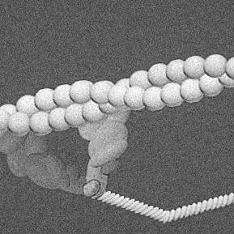

Aside
================================================================================

{width=80%}

Contact Info {#contact}
--------------------------------------------------------------------------------

- <i class="fa fa-envelope"></i> bdscott@umass.edu
- <i class="fas fa-desktop"></i> [brentscott.us](https://brentscott.us)
- <i class="fa fa-github"></i> [github.com/brentscott93](https://github.com/brentscott93)
- <i class="fa fa-phone"></i> (239) 877-0347
- For more information, please contact me via email.

Skills {#skills}
--------------------------------------------------------------------------------

- Highly trained in collection and analysis of single molecule laser trapping data

- Experience in isolation and purification of proteins

- Computer programming: proficient in R. Familiar with Bash, Markdown, HTML, and CSS.

Disclaimer {#disclaimer}
--------------------------------------------------------------------------------

Last updated on `r Sys.Date()`.

Main
================================================================================

Brent Scott {#title}
--------------------------------------------------------------------------------

### About Me

I am a PhD Candidate in the Kinesiology department at UMass Amherst with a research emphasis in single molecule biophysics and molecular muscle physiology. Specifically, I am interested in understanding how myosin transduces chemical energy into the mechanical forces that drive human motion with additional interest in the regulation of this process via the proteins troponin and tropomyosin. The primary experimental techniques I use are the laser trap and in vitro motility assays. 

Education {data-icon=graduation-cap data-concise=true}
--------------------------------------------------------------------------------

### University of Massachusetts Amherst 

PhD in Kinesiology (currently pursuing)

Amherst, MA

ETA Spring 2022

Thesis: What is the relative timing between myosin's powerstroke and phosphate release?

### University of Massachusetts Amherst

MS in Kinesiology

Amherst, MA

2019

Thesis: Tropomyosin-based effects of acidosis on thin-filament regulation during fatigue. 

### Belmont University

BS in Exercise Science

Nashville, TN

2016

Research Experience {data-icon=vial}
--------------------------------------------------------------------------------

### Graduate Research Assistant

Muscle Biophysics Lab - University of Massachusetts Amherst

Amherst, MA

2016-Current

- Perform single molecule/mini-ensemble laser trap experiments and large ensemble experiments with the *in vitro* motility assay
- Protein isolation (myosin and actin) 
- Programmed apps to automate the workflows for the analysis of laser trap and in vitro motility data using R. 

### Undergraduate Research Assistant

Neuromuscular Physiology Lab - Vanderbilt University Medical Center

Nashville, TN

2015 - 2016

- Used non-invasive techniques to study skeletal muscle blood flow *in vivo*.

Teaching Experience {data-icon=chalkboard-teacher}
--------------------------------------------------------------------------------

### Exercise Physiology - KIN 470 (online)

Instructor of Record for course using Moodle.

UMass Amherst

3x

### Human Performance & Nutrition - KIN 110 

Instructor of Record for course using Moodle.

UMass Amherst

3x

### Human Performance & Nutrition - KIN 110 (online)

Instructor of Record for course using Blackboard.

UMass Amherst

2x

### Human Performance & Nutrition - KIN 110 

Graduate teaching assistant leading discussion sections.

UMass Amherst

6x

### Applied Exercise Testing - KIN 394 

Teaching assistant for online and in-person labs. 

UMass Amherst

3x

### Exercise Physiology - KIN 470 (online)

Teaching assistant for online labs. 

UMass Amherst

1x

### Intro to Kinesiology - KIN 100

Graduate teaching assistant leading lab sections. 

UMass Amherst

1x

Selected Publications {data-icon=newspaper}
--------------------------------------------------------------------------------

###  Myosin's powerstroke occurs prior to the release of phosphate from the active site. 

Cytoskeleton. https://doi.org/10.1002/cm.21682. 

N/A

2021

**Scott B**, Marang C, Woodward M, Debold EP.

### FRET and optical trapping reveal mechanisms of actin-activation of the power stroke and phosphate-release in myosin V.

J Biol Chem. https://doi.org/10.1074/jbc.RA120.015632. 

N/A

2020

Gunther LK, Rohde JA, Tang W, Cirilo JA Jr, Marang CP, **Scott BD**, Thomas DD, Debold EP, Yengo CM. 

### Positional Isomers of a Non-Nucleoside Substrate Differentially Affect Myosin Function.

Biophysical Journal 119(3), 567-580. https://doi.org/10.1016/j.bpj.2020.06.024.

N/A

2020

Woodward M, Ostrander E, Jeong S, Liu X, **Scott B**, Unger M, Chen J, Venkataraman D, Debold EP. 

